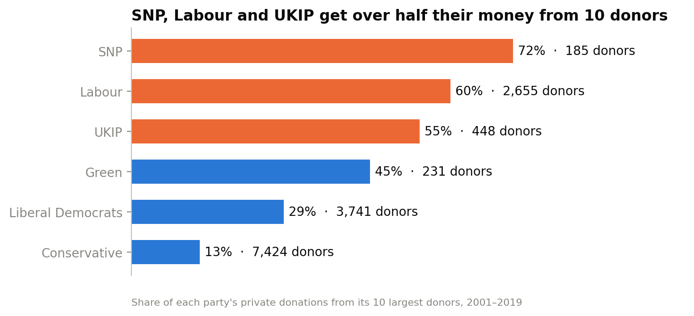
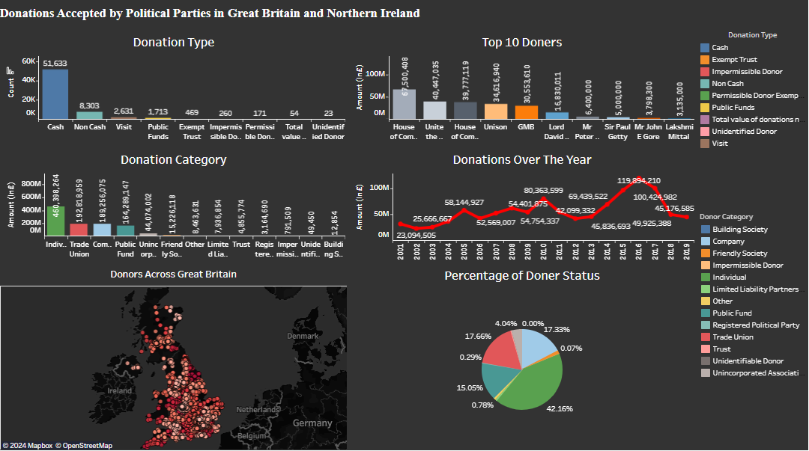
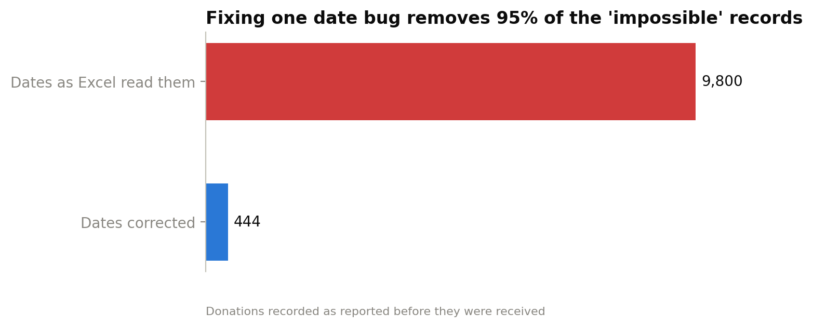
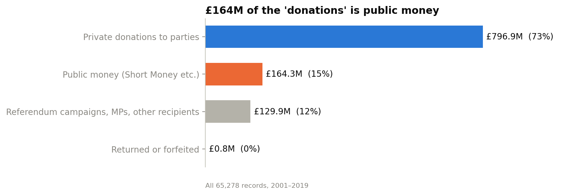
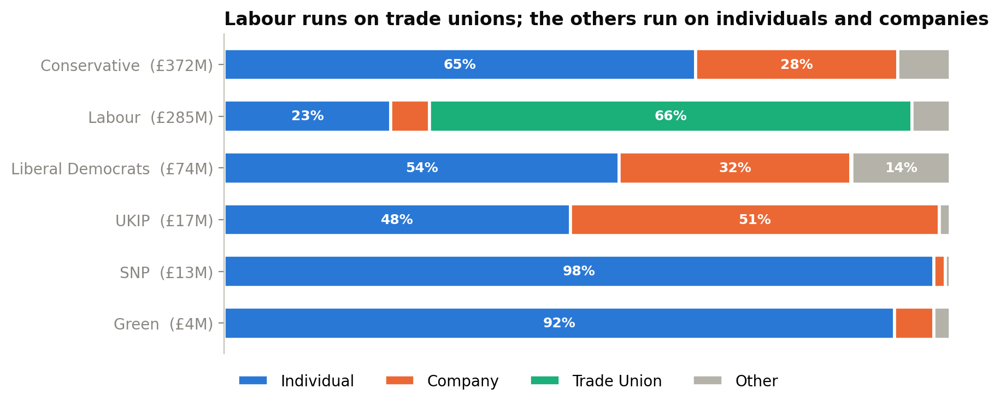
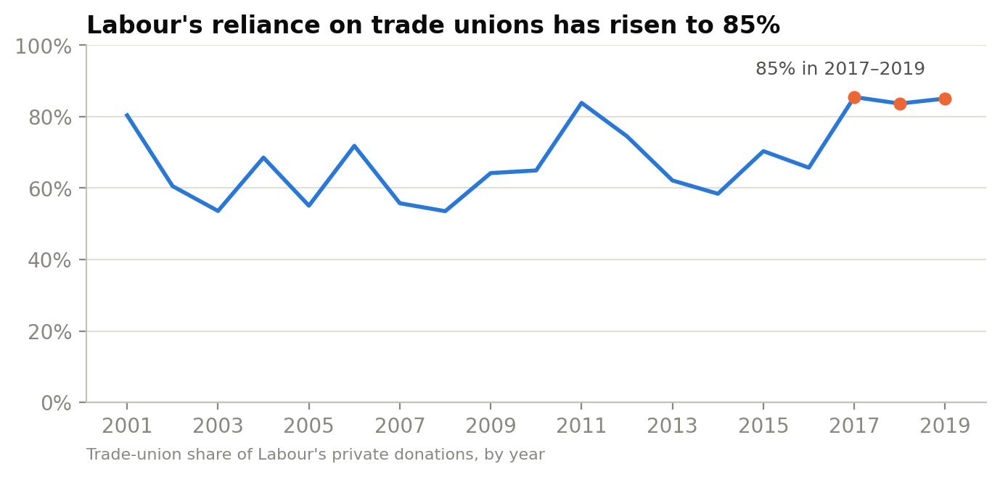
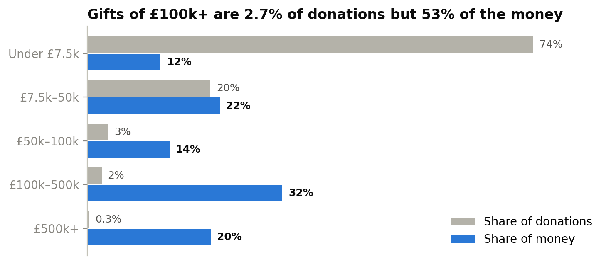
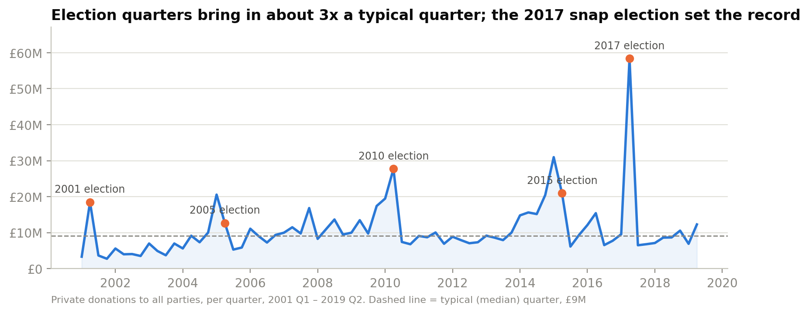
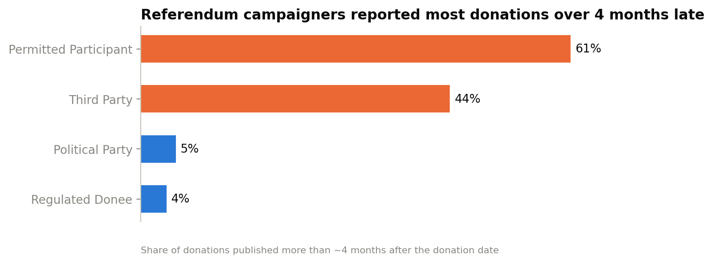

# Who Funds UK Political Parties? Funding Risk & Data Quality Review

**Tools:** Python (pandas) · SQL (SQLite) · Tableau Public
**Data:** [Electoral Commission](https://www.electoralcommission.org.uk/) register of donations: 65,278 records, £1.09 billion, Jan 2001 – Sep 2019

---

## Executive summary

The UK donations register is the public record of who funds British politics. Journalists, researchers and the regulator all work from it. I set out to answer three questions:

1. **Can the published data be trusted as-is?**
2. **How is each party funded, and how dependent is it on a few donors?**
3. **Is the reporting system working?**

**Key findings:**
- **The raw file silently corrupts a third of its dates when opened in Excel.** Fixing it removed **95%** of records that appeared to be reported before the donation was made (9,800 → 444).
- **£164M (15%) of the "donations" is public money**, such as House of Commons funding for opposition parties. Left in, the House of Commons looks like the biggest donor in British politics.
- **Funding models differ sharply.** Labour gets **66%** of its private money from trade unions. Conservatives get **65%** from individuals.
- **Dependency risk is concentrated.** SNP (**72%**), Labour (**60%**) and UKIP (**55%**) get over half their private money from just 10 donors. For the Conservatives it's **13%**.
- **A few large gifts carry the money.** Donations of £100k+ are **2.7%** of records but **53%** of the value.
- **Money follows elections.** Election quarters bring in about **3x** a typical quarter.



---

## What changed from my 2024 version

I first analysed this dataset in 2024 ([original Tableau dashboard](https://public.tableau.com/app/profile/nishad.rashid.mahi/viz/GroupProject2Dashboard2_17266285260550/Dashboard)). Coming back to it with more experience, I found that the earlier version had taken the data at face value:

| 2024 version | 2026 version |
|---|---|
| Charts of the raw data | Three business questions, answered with evidence |
| "Top donor" was the House of Commons (£67.5M) | Public money separated out; top private donors shown correctly |
| Donor name variants counted separately (e.g. Unite spelled 3 ways) | 942 donors merged by normalised name |
| Dates taken as Excel displayed them | Excel's day/month swap on a third of rows found and fixed |
| Map of donor postcodes | Dropped: postcodes are missing for 46% of rows and often point to party HQs |
| 2-line README | Findings, recommendations, limitations, reproducible pipeline |



---

## 1. Data quality audit: can the data be trusted?
*(`python/01_clean.py` · full log in [`data/clean/data_quality_log.csv`](data/clean/data_quality_log.csv))*

| # | Issue | Rows | How I handled it |
|---|---|---|---|
| 1 | **Excel swapped day and month** on every date with a day ≤ 12. Proof: converted cells never have a day above 12; text cells never have a day below 13 | 21,624 (33%) | Swapped day and month back on every converted cell |
| 2 | **The same donor is spelled several ways** ("UNITE the union", "Unite The Union") | 18,815 (29%), £386M | Merged 942 donors by normalised name (case, punctuation, "The", "Ltd") |
| 3 | **DonorId isn't a reliable key.** The same donor has several IDs | 5,208 donors | Didn't use it for grouping |
| 4 | **Public money recorded as donations** (Short Money, Electoral Commission policy grants) | 1,726, £164M | Flagged and excluded from private-donation analysis |
| 5 | **Returned or forfeited donations** (impermissible or unidentified donors) | 283, £0.8M | Excluded from accepted totals |
| 6 | **Reported before the donation date** (impossible) after the date fix | 444 | Flagged as date errors and excluded from delay statistics |
| 7 | **Donor postcode missing** | 30,265 (46%) | Not used for mapping |



## 2. Where the £1.09 billion goes



Only **£797M** is private money accepted by political parties. The rest is public funding, money to referendum campaigns and individual politicians, or donations that were returned.

**Top private donors to parties**, after merging spellings:

| Donor | Type | Total |
|---|---|---|
| Unite the Union | Trade union | £39.7M |
| UNISON | Trade union | £34.3M |
| GMB | Trade union | £30.3M |
| Union of Shop, Distributive and Allied Workers | Trade union | £22.2M |
| Communication Workers Union | Trade union | £13.4M |

Merging spellings changes the ranking. The Communication Workers Union rises from 8th to 5th (£8.2M → £13.4M), passing Lord Sainsbury, and USDAW's total grows from £13.5M to £22.2M.

## 3. Each party's funding model
*(`sql/03_party_funding_mix.sql`)*



- **Labour: 66% trade unions**, and rising. The share was **85% in 2017–2019**, up from 54–65% in the late 2000s.
- **Conservatives: 65% individuals and 28% companies**, spread across 7,424 donors.
- **SNP and Greens: over 90% individuals**, but from far fewer donors (185 and 231).



## 4. Dependency risk: how much rides on a few donors?
*(`sql/04_donor_concentration.sql`)*

| Party | Donors | Largest donor's share | Top-10 share | HHI* |
|---|---|---|---|---|
| SNP | 185 | 18% | **72%** | 1,055 |
| Labour | 2,655 | 14% | **60%** | 575 |
| UKIP | 448 | 13% | **55%** | 403 |
| Green | 231 | 8% | 45% | 287 |
| Liberal Democrats | 3,741 | 11% | 29% | 182 |
| Conservative | 7,424 | 2% | 13% | 34 |

*HHI (Herfindahl-Hirschman Index) is a standard concentration measure: the sum of squared donor shares × 10,000. Higher means more concentrated.

**What this means:** if the single largest donor stopped giving, the SNP would lose ~18% of its private income and Labour ~14%. The Conservatives would lose about 2%.

## 5. A few large gifts carry the money



**2.7%** of donations (£100k and over) account for **53%** of the money. Three in four donations are under £7.5k, but together they're only 12% of the value.

## 6. Money follows elections
*(`sql/05_election_cycle.sql`)*



| Period | Average per quarter |
|---|---|
| General-election quarter | **£27.6M** |
| Quarter before an election | £16.8M |
| Other quarters | £8.8M |

The **2017 snap election quarter (£58.4M)** is the largest on record. In 2015 the peak came in the quarter *before* the election, so parties raised money ahead of the campaign. The 2016 EU referendum brought in £64M for campaign groups, led by The In Campaign (£24.2M) and Vote Leave (£19.7M).

## 7. Is the reporting system working?
*(`sql/06_reporting_compliance.sql`)*



- **Parties report on time:** 95% of their donations are published within ~4 months, the normal quarterly cycle.
- **Referendum campaigners don't:** **61%** of their donations were published over 4 months after the donation date.
- **Impermissible donations are handled:** all **283** donations from impermissible or unidentified donors (£849k) were returned or forfeited.
- **422 donations were published over a year late** (£7.9M). The count rose from 1–3 a year before 2008 to 97 in 2015.

## 8. Recommendations

For the **register's publisher** (the regulator), and anyone who analyses the data:

| # | Recommendation | Why | Evidence |
|---|---|---|---|
| 1 | **Publish dates as `YYYY-MM-DD`** | Excel can't misread that format. Today a third of dates are silently wrong for anyone who opens the file | 21,624 rows; 9,356 false "impossible" records |
| 2 | **Give each donor one permanent ID and a standard name** | Donor-level totals are wrong without manual cleaning | 942 donors, £386M spelled inconsistently |
| 3 | **Report public funding separately from donations** | It inflates "donation" totals and tops the donor rankings | £164M, 15% of the register |
| 4 | **Focus verification on large gifts** | Checking gifts of £100k+ covers half the money with a fraction of the work | 2.7% of records = 53% of value |
| 5 | **Tighten reporting for referendum campaigns** and scale monitoring around elections | Campaigners report late, and money triples around elections | 61% late vs 5% for parties; 3x in election quarters |

For **any organisation that depends on donations** (a party finance team, a charity):

| # | Recommendation | Evidence |
|---|---|---|
| 6 | **Track the top-10 donor share as a risk KPI.** Above 50% means losing one or two donors would materially cut income | Three parties are above 50% |

## 9. Limitations

- The data ends on **2 September 2019**, so it doesn't cover the December 2019 election, and recent late reports are undercounted.
- Merging by name can't tell apart **two different people with the same name**. For individuals this may slightly overstate some totals; organisations are unaffected.
- The ~4-month threshold is a practical benchmark based on quarterly reporting, **not a legal ruling** on any individual report.
- Only donations above the reporting threshold appear in the register, so small donors are under-represented.
- The analysis describes funding patterns; it makes **no judgement about any party or donor**.

## 10. Dashboard

*The new Tableau Public dashboard is in progress. The build guide is in [`tableau/TABLEAU_GUIDE.md`](tableau/TABLEAU_GUIDE.md).*

## How to run

```bash
python3 -m venv .venv && .venv/bin/pip install -r requirements.txt
./run_all.sh
```

This cleans the raw file, loads it into SQLite, runs every SQL analysis (results in `outputs/`), exports the Tableau tables and redraws the charts.

## Project structure

```
├── data/
│   ├── raw/donations_raw.xlsx       original Electoral Commission export
│   └── clean/data_quality_log.csv   every issue found and how it was handled
├── python/
│   ├── 01_clean.py                  cleaning: dates, donor names, public money, flags
│   └── build_notebook.py            source for the analysis notebook
├── sql/                             load + 5 analysis scripts + Tableau exports
├── notebooks/analysis.ipynb         charts and statistical checks
├── outputs/                         SQL results (.txt) and charts (charts/*.png)
├── tableau/                         build guide and the original 2024 dashboard
├── requirements.txt
└── run_all.sh
```
